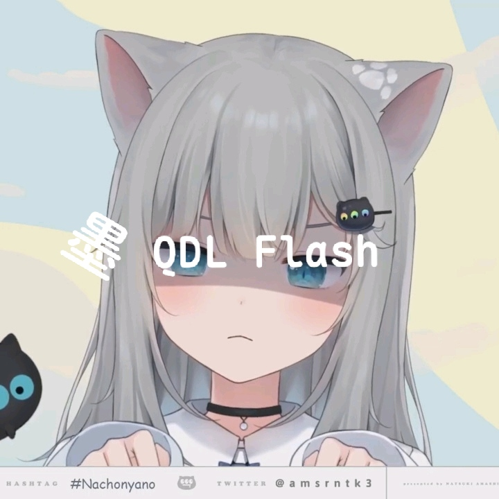

# MOFLASH

### 不 Root，也能刷。

**一款原生 Android 刷机与设备管理工具 —— 全部在手机上直接完成。**

**中文 | [English](README.en.md)**

---

## ✨ 什么是 MOFLASH

传统刷机几乎绕不开 Root 或电脑：要么 root 后进特权环境操作，要么连着电脑敲命令。

**MOFLASH 换了一条思路 —— 借助手机原生的 USB Host 能力直连设备**，把刷机需要的底层通信直接跑在 App 内。

> **一部手机 + 一根 OTG 线，即可完成全部刷写流程。**

---

## 🚀 核心特性

| | 特性 | 说明 |
|:---:|:---|:---|
| 🟢 | **免 Root** | 不解 BL、不装 Magisk、不碰系统分区，普通用户开箱即用 |
| 💻 | **无需电脑** | 手机直连，一根 OTG 线走完全流程 |
| 🔗 | **完整链路** | 9008 深刷、Fastboot、ADB 三大通道一应俱全 |
| ⚙️ | **可选 Root** | Root 是**可选项**，而不是**门槛** —— 进阶玩家也能尽兴 |

---

## 🧰 功能一览

### 🔥 9008 / EDL 深度刷写
通过 USB Host 直连高通 9008 / EDL 端口完成深度刷机。
掉进 9008、变砖救援、底层救回 —— 不 Root 也能进、也能刷。
> 支持分区刷写、批量提取、批量擦除、全盘操作。

### ⚡ Fastboot 刷写
免 Root 环境下直接进行 fastboot 分区刷写、镜像写入与设备读写。
> 支持槽位切换、分区表预览、命令行与执行历史。

### 📱 ADB 设备管理
设备识别、授权与日常管理，一个 App 全搞定。
> 支持 Shell 终端、Sideload 侧载、文件操作与快捷重启。

### 🟠 小米 / Redmi 平台刷机
识别小米线刷包结构，勾选分区逐一刷入，镜像擦除一步到位。

### 🟢 OPPO / OnePlus / realme 平台刷机
支持常规线刷与纯 FastbootD 两种模式，自动扫描镜像并预览分区。

### 📦 Payload 解压
从 `payload.bin` 中读取分区列表，按需选择解压，支持多线程与搜索。

### 🏷️ SN 修补
对指定文件进行 Bootloader SN 修补。

### 🎨 精致体验
MIUI / HyperOS 风格界面 + 液体玻璃效果，清晰的状态提示与沉浸式日志。

---

## 📲 环境要求

| 项目 | 要求 |
|:---|:---|
| 系统 | Android 7.0 (API 24) 及以上 |
| 架构 | arm64-v8a |
| 硬件 | 支持 **USB Host**（OTG） |
| 权限 | USB 访问、存储、通知等（按需申请） |

---

## 🎯 设计理念

> **把门槛降下来，把能力拉满。**

- **零成本入门** —— 不用 root、不用电脑、不用复杂环境配置
- **全流程覆盖** —— 从深刷救援到日常刷写与管理，一条链走完
- **兼顾进阶** —— 免 Root 为主，Root 增强为辅，两类用户都不将就

---

## 🛡️ 安全提示

- 刷机属于**高风险操作**，操作过程中请**勿拔线、勿断电**，否则可能导致设备变砖。
- 请务必使用**来源可靠**的固件与镜像。
- 操作前请**充分备份**重要数据。

---

## 🙏 鸣谢

感谢每一位在开发过程中给予赞赏与测试支持的朋友。

> 详见 App 内「关于 → 鸣谢人员」页面。

---

**无需 Root，一部手机，即可刷写。**

[⬆ 返回顶部](#)

